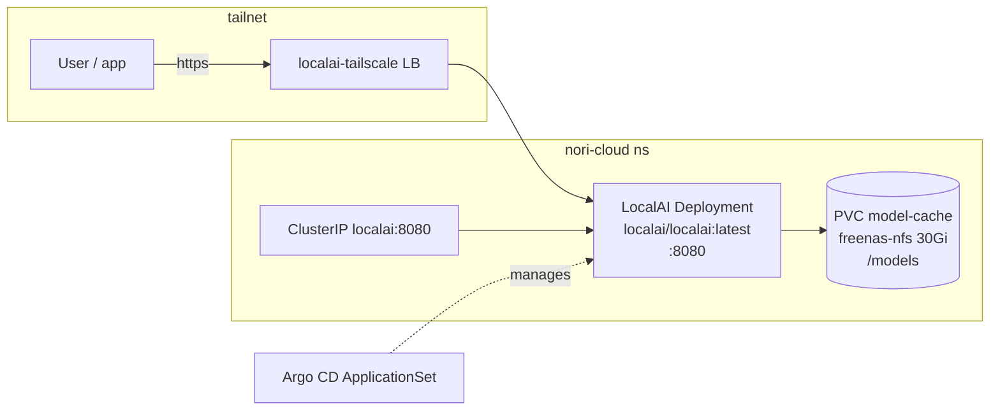

# LocalAI Experimentation Server — Design

**Date:** 2026-06-04
**Status:** Approved design

## Goal

Self-host an easy way to try different models on CPU (voice, embeddings, LLM) behind
one OpenAI-compatible endpoint. Deploy [LocalAI](https://localai.io/) as a standalone
**experimentation** server in the homelab, exposed on the tailnet, managed by Argo CD —
following the existing `apps/` pattern.

## Why LocalAI

LocalAI is the one CPU-friendly server that covers the breadth the user wants behind a
single OpenAI-compatible API, plus a built-in **model gallery + Web UI** for click-to-try
model installation (the "Ollama for everything" experience).

| Capability | CPU backend(s) | OpenAI endpoint |
|---|---|---|
| STT | whisper.cpp | `/v1/audio/transcriptions` |
| TTS | Piper, Coqui/XTTS, Bark | `/v1/audio/speech` |
| LLM | llama.cpp (GGUF) | `/v1/chat/completions` |
| Embeddings | sentence-transformers, bert.cpp | `/v1/embeddings` |
| Image gen | stable-diffusion | `/v1/images/generations` |

**Rejected alternative — Speaches:** leaner and the natural successor to the existing
`whisper` app, but voice-only (Whisper STT + Kokoro/Piper TTS). It cannot serve
embeddings or LLMs, which the user wants to experiment with. LocalAI's breadth wins for
an experimentation server; the cost is a heavier image, more config surface, and slow
CPU LLM inference (acceptable — `outpost` already uses the hosted DeepSeek API for real
LLM work).

## Scope

**In scope:** a new `localai` app deployed alongside the existing `kokoro` + `whisper`
apps, used purely for experimentation.

**Out of scope (explicit):**
- No changes to `outpost` or its `VOICE_TTS_URL` / `VOICE_STT_URL` secrets.
- No migration or removal of `kokoro` / `whisper` — they keep serving production.
- No promotion of any LocalAI-hosted model into production (a possible future, separate task).

## Architecture



Single replica, CPU-only, OpenAI-compatible. The `/models` directory is a **cache**
(gallery downloads + backends), not precious state — persisted only to avoid re-downloading
multi-GB models on restart.

## Components — `apps/localai/`

Mirrors the `kokoro` / `whisper` app layout, **except** it uses a `Deployment` + standalone
`PersistentVolumeClaim` instead of a `StatefulSet` (LocalAI is a single-replica cache-backed
service with no stable-identity / ordered-scaling needs).

### `deployment.yaml`
- `kind: Deployment`, `replicas: 1`, namespace `nori-cloud`
- `strategy: { type: Recreate }` — required to avoid an RWO/NFS multi-attach deadlock that
  the default RollingUpdate would cause on the single `/models` volume
- Container:
  - image `localai/localai:latest` (vanilla CPU; no preloaded models)
  - port `8080` (name `http`) — Web UI + model gallery served at `/`
  - volume mount: `model-cache` → `/models`
  - `startupProbe` + `readinessProbe` HTTP GET `/readyz` on `8080`
    (generous startup `failureThreshold` — first backend pulls are slow)
  - resources: requests `2Gi` / `1000m`, limits `8Gi` / `4000m`

### `pvc.yaml`
- `kind: PersistentVolumeClaim`, name `localai-model-cache`, namespace `nori-cloud`
- `accessModes: [ReadWriteOnce]`, `storageClassName: freenas-nfs`, `storage: 30Gi`
  (larger than the 10Gi voice apps because GGUF LLMs are multi-GB)

### `service.yaml`
Two services, matching the repo pattern:
- `localai` — `ClusterIP`, port `8080` → for in-cluster consumers
- `localai-tailscale` — `LoadBalancer`, `loadBalancerClass: tailscale`,
  annotation `tailscale.com/hostname: localai`, port `8080` → tailnet access

### `kustomization.yaml`
Lists `pvc.yaml`, `deployment.yaml`, `service.yaml`.

## Registration

Add one element to `apps/nori-cloud/application-set.yaml` `list` generator:

```yaml
- app: localai
```

Argo CD then auto-syncs `apps/localai/` (automated sync, prune, self-heal) into the
`nori-cloud` namespace.

## How the user tries models

1. Open `https://localai` (tailnet hostname) → LocalAI Web UI.
2. Models gallery → install a Whisper / Piper / XTTS / embedding / GGUF LLM model.
3. Call it via the OpenAI-compatible endpoint (`localai:8080` in-cluster, or the tailnet host).

## Verification / success criteria

1. `kubectl get applications -n argo-cd` shows `localai` Synced + Healthy.
2. `kubectl get pods -n nori-cloud -l app=localai` → pod Running, readiness probe passing.
3. `localai-tailscale` LB gets a tailnet hostname; `https://localai/` serves the Web UI.
4. Install one model from the gallery and get a successful response from its OpenAI endpoint
   (e.g. a TTS `/v1/audio/speech` or embeddings `/v1/embeddings` call).
5. `kokoro` + `whisper` remain Synced/Healthy and `outpost` voice is unaffected.

## Open parameters (adjust before/at implementation)

- Storage size `30Gi` and memory limit `8Gi` are starting estimates — tune to actual model sizes.
- `latest` tag is used for easy experimentation; pin to a version tag if reproducibility becomes important.
